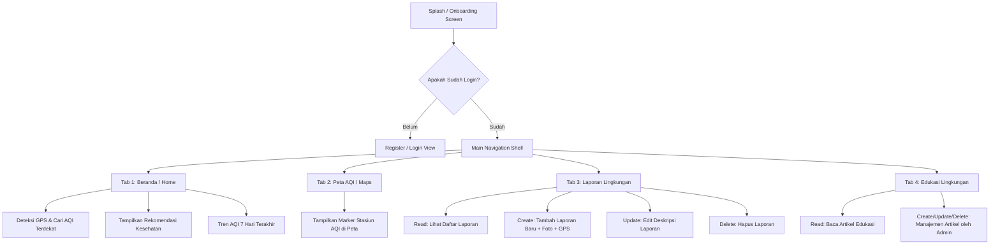

# Panduan Presentasi & Demo Aplikasi RUAS (Rukun Udara & Asri Selaras)

Dokumen ini disusun untuk membantu Anda melakukan presentasi demo aplikasi **RUAS** di depan audiens/penguji dengan gaya penyampaian layaknya seorang **Sales / Product Owner**.

---

## 📋 Outline Slide PowerPoint (Maksimal 15 Menit)

Berikut adalah pembagian slide beserta poin-poin yang wajib disampaikan dan panduan narasinya:

### Slide 1: Pembuka & Hook (1 Menit)
*   **Judul Slide**: RUAS (Rukun Udara & Asri Selaras) - *Napas Bersih, Lingkungan Asri, Masa Depan Lestari*
*   **Visual**: Logo RUAS (`assets/images/logo_ruas.png`) dengan latar belakang bertema lingkungan yang modern (vibrant teal/clean design).
*   **Poin Penyampaian**:
    *   Sapa penguji/audiens dengan percaya diri tinggi.
    *   **Hook**: "Tahukah Anda bahwa partikel halus PM2.5 yang kita hirup setiap hari diam-diam memotong usia harapan hidup masyarakat perkotaan? Di sisi lain, sampah liar menumpuk tanpa tindakan cepat. Kami di sini untuk menyelesaikan itu."

### Slide 2: Latar Belakang & Solusi (2 Menit)
*   **Judul Slide**: The Problem & The Solution
*   **Visual**: Grafik/infografis sederhana tentang dampak buruk polusi udara & tumpukan sampah liar.
*   **Isi Slide**:
    *   **Masalah (Problem)**:
        1. Kurangnya data kualitas udara real-time di tingkat lokal.
        2. Alur pelaporan masalah lingkungan konvensional lambat dan tidak transparan.
        3. Rendahnya edukasi masyarakat tentang aksi nyata ramah lingkungan.
    *   **Solusi (Solution) - RUAS App**:
        Platform mobile berbasis Flutter yang mengintegrasikan pemantauan kualitas udara (AQI) real-time, pelaporan masalah lingkungan berbasis komunitas (*crowdsourcing*), dan media edukasi interaktif.

### Slide 3: Fitur Unggulan (3 Menit)
*   **Judul Slide**: Fitur Utama RUAS: Perlindungan Lingkungan di Genggaman Anda
*   **Visual**: Tata letak grid ikonik dari 4 fitur utama.
*   **Isi Slide**:
    1.  **Monitor AQI Real-Time & GPS**: Otomatis mendeteksi lokasi pengguna dan mencari stasiun pemantau AQI terdekat, menampilkan indeks kesehatan secara instan.
    2.  **Peta Polusi Interaktif**: Peta visual yang menandai zona-zona kualitas udara di berbagai wilayah.
    3.  **Laporan Lingkungan Cepat (CRUD)**: Mengambil foto bukti, pin lokasi koordinat GPS secara otomatis, dan melacak progres laporan ('Diproses' hingga 'Selesai').
    4.  **Edukasi & Tips Hijau**: Akses informasi terpercaya mengenai mitigasi polusi dan pola hidup sehat.

### Slide 4: Alur Aplikasi / User Flow (3 Menit)
*   **Judul Slide**: Bagaimana Cara Kerja RUAS? (Alur Aplikasi)
*   **Visual**: Diagram alur kerja aplikasi (Lihat diagram Mermaid di bawah).
*   **Poin Penyampaian**:
    *   Jelaskan bagaimana pengguna berinteraksi dari awal (Onboarding) hingga melakukan aksi nyata (membuat laporan).



### Slide 5: Arsitektur Database (2 Menit)
*   **Judul Slide**: Arsitektur Database & Keamanan Data
*   **Visual**: Hubungan tabel SQLite (`users` ➔ `laporan` & `edukasi`).
*   **Isi Slide**:
    *   Menggunakan database **SQLite** lokal (`ruas_app.db`) yang dikelola oleh `RuasDbHelper` untuk performa tinggi tanpa koneksi internet wajib (*offline-first capability*).
    *   Diagram Relasi Database (ERD):

```mermaid
erDiagram
    USERS {
        int id PK
        string nama
        string email UNIQUE
        string nomor_telp
        string password
        string tanggal_daftar
        string tempat_lahir
        string tanggal_lahir
    }
    
    LAPORAN {
        int id PK
        string judul
        string kategori
        string lokasi
        string koordinat
        string deskripsi
        string status
        string tanggal
        int user_id FK
        string foto
    }
    
    EDUKASI {
        int id PK
        string judul
        string kategori
        string konten
        string gambar
        string tanggal
    }
    
    USERS ||--o{ LAPORAN : "memiliki"
```

*   **Poin Penting Database**:
    *   Satu **User** dapat memiliki banyak **Laporan** (Relasi *One-to-Many* melalui FK `user_id` dengan aksi `ON DELETE CASCADE`).
    *   Tabel **Edukasi** berdiri mandiri dan dikonsumsi oleh semua pengguna untuk meningkatkan *awareness*.

### Slide 6: Pivot & Perubahan Arah Pengembangan (2 Menit)
*   **Judul Slide**: Pengembangan & Pivot Ide (Adaptabilitas)
*   **Visual**: Ikon "Gear" atau "Branching".
*   **Isi Slide**:
    *   **Proposal Awal**: Direncanakan terhubung ke sensor fisik IoT (hardware) langsung melalui Bluetooth/MQTT, yang membatasi penggunaan aplikasi hanya bagi pemilik perangkat keras.
    *   **Pivot Strategis**: Mengubah model input ke **Hybrid Crowdsourcing & Open API**. Kami memanfaatkan GPS perangkat pengguna dan mensimulasikan stasiun AQI terdekat (seperti stasiun Sukabumi, Jakarta, Bandung, dsb.) dengan memetakan lokasi real-time pengguna menggunakan **OpenStreetMap Reverse Geocoding (Nominatim)**.
    *   **Peningkatan DB (Versi 2)**: Melakukan migrasi database untuk menambahkan kolom `tempat_lahir` dan `tanggal_lahir` pada pengguna demi memperkuat verifikasi profil pelapor agar terhindar dari laporan palsu (*hoax reporting*).

### Slide 7: Preview UI & Rekaman Layar (Diintegrasikan saat Demo)
*   **Judul Slide**: Demo Aplikasi RUAS
*   **Visual**: Tampilkan video singkat / mockup tangkapan layar utama:
    *   *Onboarding Page*: Desain yang interaktif memandu pengguna.
    *   *Home Dashboard*: Desain Teal & Slate yang bersih dengan grafik AQI line chart 7 hari.
    *   *Interactive Maps*: Integrasi Flutter Map dengan penanda AQI berwarna (Hijau: Baik, Kuning: Sedang, Oranye/Merah: Tidak Sehat).
    *   *Form Laporan*: Antarmuka yang bersih untuk memilih kategori laporan, mengambil koordinat otomatis, serta melampirkan foto.

### Slide 8: Penutup & Call to Action (1 Menit)
*   **Judul Slide**: Bersama RUAS, Wujudkan Indonesia Asri!
*   **Poin Penyampaian**:
    *   "RUAS bukan sekadar aplikasi pemantau, melainkan gerakan perubahan sosial. Mari kita kembalikan langit biru kita, laporkan pencemaran, dan edukasi generasi penerus. Terima kasih."

---

## 🛠️ Panduan Demo Aplikasi (Skenario Live Demo)

Agar demo berjalan lancar dan mengesankan, ikuti skenario pengoperasian berikut:

1.  **Langkah 1: Splash & Onboarding**
    *   Jelaskan transisi indah dari logo RUAS ke halaman panduan fitur (Onboarding). Tunjukkan halaman onboarding yang responsif.
2.  **Langkah 2: Registrasi & Login**
    *   Tunjukkan proses registrasi user baru. Jelaskan bahwa data disimpan aman secara lokal di SQLite. Masuk menggunakan akun terdaftar (atau akun bawaan: `andi.pratama@gmail.com` / `password123`).
3.  **Langkah 3: Dashboard Utama (Home)**
    *   Soroti kartu indikator kualitas udara. Tekan tombol refresh atau biarkan aplikasi mendapatkan lokasi GPS Anda secara otomatis melalui Nominatim API.
    *   Tunjukkan grafik tren kualitas udara 7 hari dan rekomendasi aktivitas kesehatan yang dinamis berdasarkan nilai AQI.
4.  **Langkah 4: Fitur Peta (Maps)**
    *   Pindah ke Tab Peta. Tunjukkan stasiun AQI terdekat dari lokasi Anda dan bagaimana warnanya menyesuaikan tingkat kesehatan udara (Hijau, Kuning, Merah).
5.  **Langkah 5: Flow CRUD Laporan (Fitur Unggulan)**
    *   *Create*: Buka halaman pelaporan, buat laporan baru (misal: "Pembakaran Sampah Liar"). Masukkan deskripsi, pilih kategori, dan klik pin lokasi koordinat GPS. Simpan.
    *   *Read*: Tunjukkan bahwa laporan tersebut langsung masuk ke daftar riwayat laporan dengan status awal **"Diproses"**.
    *   *Update*: Demo-kan bagaimana pengguna bisa mengedit deskripsi jika ada informasi tambahan.
    *   *Delete*: Tunjukkan opsi menghapus laporan jika dibatalkan oleh pengguna.
6.  **Langkah 6: Edukasi & Profil**
    *   Tunjukkan daftar artikel edukasi kesehatan udara.
    *   Masuk ke menu Profil untuk menunjukkan detail profil pengguna dan fitur ganti kata sandi.
